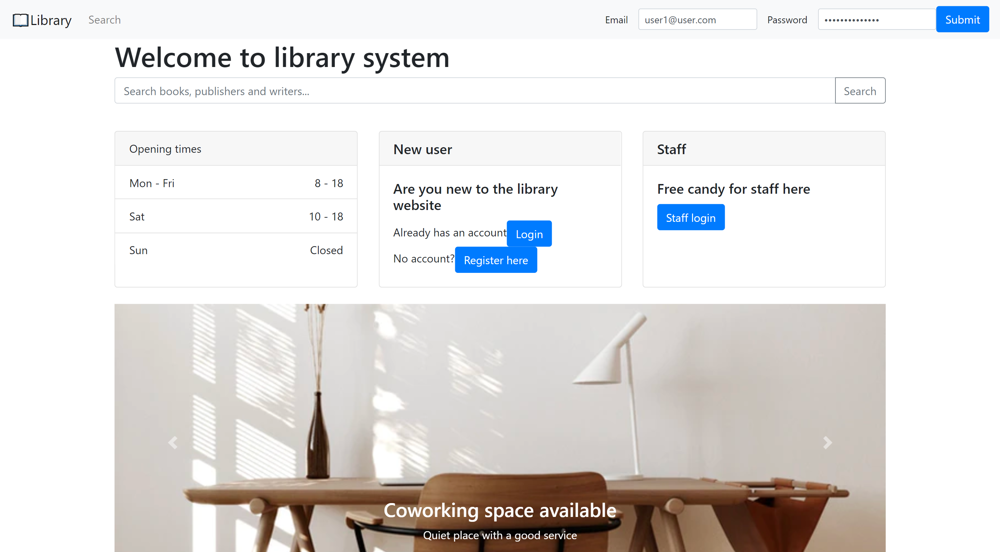

# Library Management System Frontend

[Backend Repo](https://github.com/thananonp/sssf-project-frontend)

[Deployed Frontend](https://sssf-frontend.web.app/)

## About

This project is made for server-side scripting service. This is the frontend part.

This project is made using these libraries

* Apollo Client
* JSON Web Token
* GraphQL
* React
* React Router
* React Bootstrap

## Project structure

    .
    ├── .firebase         # Folder containing firebase config
    ├── public            # Folder containing static built file
    ├── src               # Source files
    │   ├── helpers       # For initializing libraries, helpers function
    │   ├── hooks         # For creating React hooks
    │   ├── pages         # For pages to be display
    │   ├── reducers      # For create Redux reducer
    │   ├── App.js       
    ├── LICENSE
    └── README.md

## Sources Components

Components contain React components that is display in more than one page. Eg. LoadingSpinner Landing is the homepage
where user will land on. NavBar will show base on the login state. Search is the search page.

Author, Book, Category, Publisher will have

* view page
* add page
* edit page.

User and Staff will have

* Change Password Page
* Home Page
* Login Page
* Register Page
* Setting Page

## Overview

##### Login

When the user or the staff log in. The website sends the login credentials to the backend via GraphQL. The server then
will authenticate and send the token back to the frontend. The token is kept in Local Storage and also the Redux state.

##### Logout

When the user or staff click logout. The state and Local Storage will be cleared.

##### Permission Lock

If you visit the page that require the permission. The website will check for the token and verified it. If the token
cannot be verified. The webpage will redirect to the landing page to prevent the information from being accessed.

##### Search

When you input the search query. It is dispatched via Redux and the query is executed when the page is loaded. You can
click the link to go and view the information about the Author, Book, Category and Publisher.

#### Mutation

Mutation can only be done by staff members. So the add, edit and delete operation can only be done by staff members
only.

##### GraphQL

The queries and the mutations is done by Apollo Server. Frontend also has error handling. If the fetch is failed, the
alert is shown.

